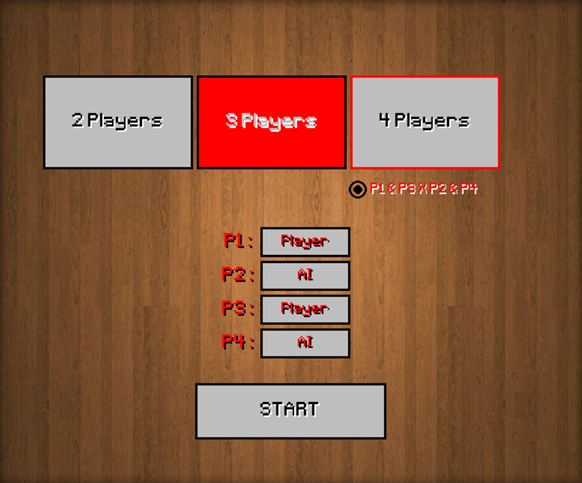

# Domino Game Project

## Overview

This project is a digital implementation of the classic **Domino** game, designed using **Object-Oriented Programming (OOP)** principles. The game allows for both human and AI players, providing an engaging gaming experience while demonstrating core OOP concepts such as encapsulation, inheritance, and polymorphism.

### Start Window

### Game

---

## Table of Contents
- [Features](#features)
- [Classes and Their Responsibilities](#classes-and-their-responsibilities)
- [Gameplay Instructions](#gameplay-instructions)
- [AIPlayer Development Status](#aiplayer-development-status)
- [Naming Conventions](#naming-conventions)

---

## Features
- Support for multiple players, including human and AI players.
- Domino piece placement mechanics, ensuring pieces are placed correctly on the board.
- Capture of opponent pieces when applicable.
- A user-friendly interface with a visual representation of the game board and pieces.

## Classes and Their Responsibilities

### 1. `Game`
- Manages the overall game flow, including player management, pieces, and the board. Controls rounds and game state.

### 2. `Player`
- Represents a player in the game. Manages the player's pieces, providing methods to play pieces and check for valid moves.

### 3. `HumanPlayer`
- Inherits from `Player` and handles user input for selecting and placing pieces on the board.

### 4. `AIPlayer`
- Inherits from `Player` and implements automated gameplay logic, deciding which piece to play based on the current state of the game.

### 5. `Piece`
- Represents a domino piece, holding values for the two sides of the piece and providing methods to check its compatibility with other pieces on the board.

### 6. `Map`
- Represents the game board, managing placed pieces and checking if moves are valid.

### 7. `Control`
- Manages game interactions, such as controlling screens and transitions between the start window and the game window.

### 8. `StartWindow`
- Represents the start screen where players choose game settings, such as number of players and whether they play against bots.

---

## Gameplay Instructions

- The game can be played between 2 to 4 players, with the possibility of playing against bots.
- Each player has a set of pieces and, in each round, must play a piece that matches the ends of the board.
- The objective is to be the first to run out of pieces.
- If a player cannot play, they pass their turn.
- The game ends when a player places all their pieces or when the game is blocked (no player can make a valid move).

---

## AIPlayer Development Status

The `AIPlayer` class is under development and aims to implement automated gameplay logic for the game. Here are the key objectives and features expected from the `AIPlayer`:

### Objectives
- **Automated Decision-Making:** The `AIPlayer` will evaluate the game state and make decisions without requiring user input, simulating a human player's actions.

- **Movement Logic:** The bot will decide which piece to play based on the board ends and the pieces it holds, looking to play the most optimal pieces.

- **Heuristics and Simple Rules:**
  - **Maximizing Play:** The bot will try to play pieces that free up options for future rounds.
  - **Blocking Moves:** The bot will prioritize blocking opponent moves when possible.

- **Strategic Decision-Making:** The bot will be programmed to play more "intelligently," considering the possibility of winning and managing its remaining pieces.

### Current Status
Currently, the `AIPlayer` is ***in progress*** and does not yet have fully implemented decision-making logic. Future updates will focus on developing the `update` method and integrating the necessary rules and heuristics.

---

## Naming Conventions

### 1. Variables, Functions, Modules, and Packages
- **Format:** Use `snake_case` for naming variables, functions, modules, and packages.
- **Examples:** 
  - Variables: `total_sum`, `user_age`, `max_value`
  - Functions: `calculate_area()`, `fetch_user_data()`, `validate_input()`
  - Modules: `data_processing`, `user_management`, `payment_gateway`
  - Packages: `my_package`, `utils_module`

### 2. Classes
- **Format:** Use `PascalCase` for naming classes.
- **Examples:** `UserProfile`, `OrderManager`, `DataProcessor`

### 3. Abbreviations
- **Guideline:** Abbreviations are allowed when they are widely recognized (e.g., use `info` instead of `information`).
  
### 4. Comments
- **Guideline:** Comments can be written in English or Portuguese, but should explain the *why* of the code, not the *how* it works.

### Final Note
Following these conventions is essential for maintaining consistency and readability throughout the project. Non-compliance may lead to code that is difficult to maintain and understand.